# Enterprise Production-Grade CI/CD Pipeline Guide

This guide is designed for interview preparation and real-world DevOps practice. It shows how a production-grade CI/CD pipeline should look for enterprise teams.

## 1. What makes a pipeline "production grade"?
A production-grade pipeline should:
- Be deterministic and repeatable
- Use secure secret handling
- Validate code quality before deployment
- Promote verified artifacts between environments
- Include approvers for production
- Support rollback and observability
- Use infrastructure as code where possible
- Keep deployment strategies safe and predictable

## 2. Recommended enterprise pipeline flow

```mermaid
flowchart LR
    A[Developer Commit] --> B[PR Validation]
    B --> C[Build]
    C --> D[Unit Tests]
    D --> E[Static Analysis]
    E --> F[Security Scan]
    F --> G[Package Artifact]
    G --> H[Push to Registry]
    H --> I[Deploy to Dev]
    I --> J[Deploy to Staging]
    J --> K[Manual Approval]
    K --> L[Deploy to Production]
    L --> M[Monitor + Rollback Plan]
```

## 3. Enterprise pipeline stages

### Stage 1: Source and PR checks
- Validate branch policies
- Require code review
- Run linting and unit tests on pull requests
- Block merge on failed checks

### Stage 2: Build
- Install dependencies
- Compile or package the application
- Produce a single immutable build artifact

### Stage 3: Test
- Unit tests
- Integration tests
- Contract/API tests
- Smoke tests

### Stage 4: Security and quality gates
- SAST: static code scanning
- SCA: dependency scanning
- Container image scanning
- Secrets detection
- Code coverage threshold

### Stage 5: Artifact management
- Push image or package to a secure registry
- Tag artifacts with build number and git commit SHA
- Use immutable artifacts

### Stage 6: Deployment to environments
- Dev: automatic deployment
- Staging: automatic deployment after checks
- Production: manual approval + rollout strategy

### Stage 7: Post-deployment validation
- Health checks
- Monitoring alerts
- Smoke tests
- Rollback readiness

## 4. Enterprise best practices

### Security
- Never hardcode secrets
- Use vaults or secret stores
- Restrict permissions using least privilege
- Scan dependencies and container images
- Use signed artifacts where possible

### Reliability
- Use retries for transient failures
- Use retryable network logic
- Keep pipeline logs and artifacts available
- Use rollback strategies for every deployment

### Governance
- Enforce branch protection rules
- Require approved reviews
- Use environment approvals for production
- Track deployment history

### Scalability
- Cache dependencies
- Run jobs in parallel where safe
- Use reusable templates or workflows
- Keep reusable scripts in version control

## 5. Production deployment strategies
- Blue-Green Deployment
  - Two environments run at once
  - Safer cutover for production
- Rolling Deployment
  - Update instances gradually
  - Minimizes risk and downtime
- Canary Deployment
  - Send a small percentage of traffic first
  - Good for validating production behavior

## 6. Rollback strategy checklist
- Keep previous artifact versions available
- Store deployment manifest history
- Use versioned images and tags
- Validate health checks after rollback
- Document rollback steps and owner

## 7. Step-by-step interview preparation plan

### Week 1: Fundamentals
1. Learn Git basics: clone, commit, branch, merge, rebase
2. Understand Linux commands used in pipelines
3. Learn Docker concepts: image, container, Dockerfile, volumes, networking

### Week 2: CI/CD basics
1. Understand build, test, package, deploy stages
2. Learn pipeline triggers and workflow syntax
3. Practice secrets handling and approvals

### Week 3: Deployment tools
1. Study GitHub Actions, Azure DevOps, GitLab CI, Jenkins
2. Learn how each tool handles variables, artifacts, and environments
3. Compare how they support approvals and rollback

### Week 4: Kubernetes and IaC
1. Learn Deployment, Service, ConfigMap, Secret, Ingress
2. Understand rolling updates and probes
3. Study Terraform basics and remote state

### Week 5: Interview practice
1. Practice answering 20 common questions
2. Explain one pipeline end to end in 3–5 minutes
3. Be ready to discuss security, rollback, and troubleshooting

## 8. How to answer “Explain a CI/CD pipeline” in interviews
Use this structure:
1. Start with the trigger
2. Explain code validation
3. Show artifact creation
4. Explain test and security checks
5. Show deployment to dev/staging/prod
6. Mention approvals, monitoring, and rollback

## 9. Common enterprise interview questions
- What is the difference between CI, CD, and deployment strategies?
- How do you handle secrets securely?
- How do you prevent a bad build from reaching production?
- What is artifact promotion?
- How do you rollback a bad deployment?
- Why are approvals important in production?
- How do you make pipelines idempotent?

## 10. Practical checklist before you walk into the interview
- You can explain the pipeline stages clearly
- You can describe how secrets are managed
- You can outline a rollback plan
- You can explain Kubernetes deployment behavior
- You can explain Terraform in CI/CD context
- You can talk about security scanning and quality gates
