# CI/CD Pipeline Flow Diagram

```mermaid
flowchart LR
    A[Developer Pushes Code] --> B[CI Pipeline Trigger]
    B --> C[Checkout Code]
    C --> D[Build Artifact]
    D --> E[Run Unit Tests]
    E --> F[Run Security Scan]
    F --> G[Deploy to Dev]
    G --> H[Deploy to Staging]
    H --> I[Approval for Production]
    I --> J[Deploy to Production]
    J --> K[Monitoring and Rollback Check]
```

## Interview explanation
- The pipeline starts when code is pushed or manually triggered.
- Each stage validates the code before moving forward.
- Production deployment should include approval and monitoring.
- Rollback is part of the deployment strategy and should be planned ahead.
